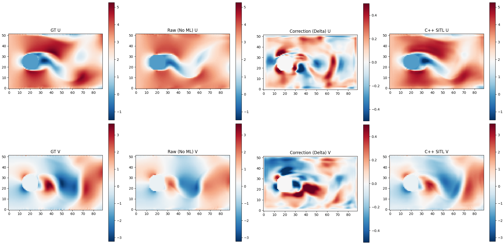
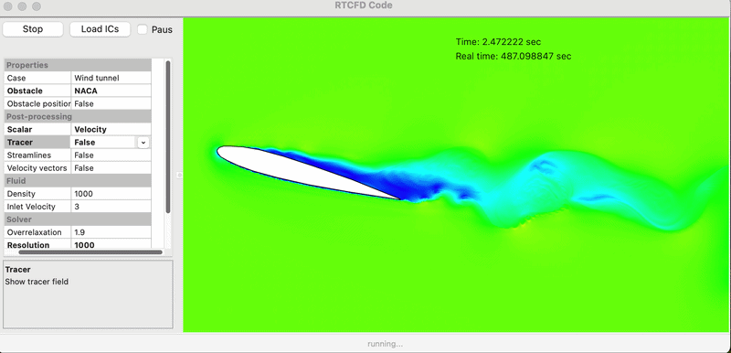

# Real-time Computational Fluid Dynamics (ML-Enhanced)

Machine Learning Enhanced Real-Time CFD — currently under dev and training by Mohammad Moezzibadi. A ML Module is integrated but the training part is not public yet.

**This repository is a fork of [skhelladi/wxRTCFD_Code](https://github.com/skhelladi/wxRTCFD_Code), originally developed by Sofiane KHELLADI.** 
The original OpenMP parallelized core and the wxWidgets graphical interface were authored by Sofiane KHELLADI.

The project extends the real-time CFD solver with machine learning correction for adaptive flow prediction and enhanced real-time performance.

### ML Correction Performance Demo

*Showcasing real-time ML correction for flow prediction.*



### Metal GPU Performance Demo (GPU Version)

*Showcasing real-time simulation at high resolution (1,000,000 cells) using Metal Compute Shaders.*

*Note: The ML correction is trained on a single thread (no parallelization) to ensure bit-perfection during the training process, but it is implemented in the GPU version (see `GPU_version` branch) as a proof of concept. It has been tested and verified on macOS hardware (GPU 1.5 GB).*

Before building the project, make sure the following libraries are installed:
- **wxWidgets**
- **OpenMP**
- **LibTorch**

## Features
This project is a real-time CFD solver based on a "rough" representation of conservation equations. The solver is implemented in **C/C++** for **real-time** purpose and **wxWidgets** for the user interface and graphical renderings. It supports:
- 2D problems (3D in progress)
- Real-time flow pattern variation
- Variety of obstacles
- Postprocessing using: scalars (pressure, velocity, tracer), streamlines and velocity vectors

## Install and build
### Using cmake (command-line)
```bash
mkdir build
cd build
# set CMAKE_PREFIX_PATH to your LibTorch location
cmake .. -DCMAKE_BUILD_TYPE=Release -DCMAKE_PREFIX_PATH=/path/to/libtorch
make -j
```

## Authors
- **Mohammad Moezzibadi** (ML Correction & GPU implementation)
- **Sofiane KHELLADI** (Original OpenMP Solver & wxWidgets UI)

## License
This project is licensed under the GPL-3 license.

### Code inspiration
This code is based on the theoretical developments and javascript code presented by Matthias Müller in "Ten Minute Physics" channel.
Link: https://matthias-research.github.io/pages/tenMinutePhysics/17-fluidSim.pdf
